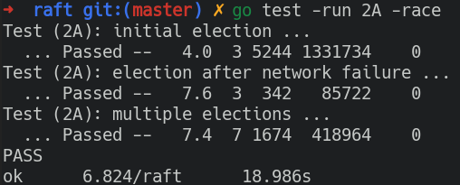

### MIT 6.824 2021 Spring   
- [X] Read [MapReduce (2004)](https://pdos.csail.mit.edu/6.824/papers/mapreduce.pdf)  
- [X] Lab 1: MapReduce   
    

> Helpful materials for raft:  
> [Raft paper](https://pdos.csail.mit.edu/6.824/papers/raft-extended.pdf)  
> [CONSENSUS: BRIDGING THEORY AND PRACTICE](https://link.zhihu.com/?target=https%3A//web.stanford.edu/~ouster/cgi-bin/papers/OngaroPhD.pdf)  
> Guides:   
> [Students' Guide to Raft](https://thesquareplanet.com/blog/students-guide-to-raft/)  
> [Raft Locking Advice](https://pdos.csail.mit.edu/6.824/labs/raft-locking.txt)  
> [Raft Structure Advice](https://pdos.csail.mit.edu/6.824/labs/raft-structure.txt)  
> Visualizations:  
> [diagram of Raft interactions](https://pdos.csail.mit.edu/6.824/notes/raft_diagram.pdf)  
> [The Secret Lives of Data](http://thesecretlivesofdata.com/raft/)  
> [raft.github.io](https://raft.github.io/)  
- [X] Read [Raft (extended) (2014)](https://pdos.csail.mit.edu/6.824/papers/raft-extended.pdf), to end of Section 5(include leader election, log replication, safty)  
- [X] Lab 2A: leader election  
    
- [X] Read [Raft (extended) (2014)](https://pdos.csail.mit.edu/6.824/papers/raft-extended.pdf), Section 7 to end (but not Section 6)